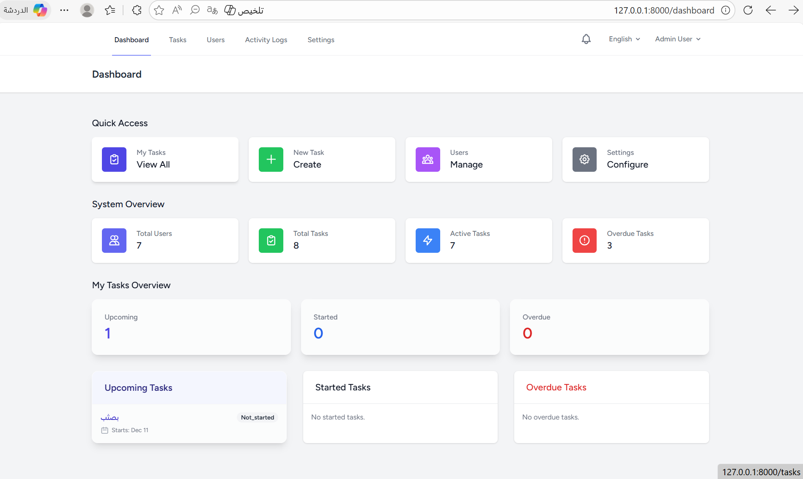

# Task Management System

A comprehensive, modern Task Management System built with Laravel 10. Designed to streamline team collaboration, task tracking, and project management with a premium user interface.



## 🚀 Features

- **User Management**: Role-based access control (Admin, Manager, User).
- **Task Tracking**: Create, assign, and track tasks with priorities and deadlines.
- **Modern Dashboard**: Real-time overview of upcoming, started, and overdue tasks.
- **Notifications**: In-app and email notifications for assignments and reminders.
- **File Attachments**: Upload and manage files for each task.
- **Admin Panel**: Full control over users, settings, and system logs.
- **Activity Logging**: Detailed history of all system actions.
- **Responsive Design**: Beautiful, glassmorphism-inspired UI built with Tailwind CSS.

## 🛠️ Technology Stack

- **Backend**: Laravel 10 (PHP 8.1+)
- **Frontend**: Blade, Alpine.js, Tailwind CSS
- **Database**: SQLite (Default), MySQL/PostgreSQL supported
- **Queue**: Database/Redis

## 📋 Prerequisites

- PHP >= 8.1
- Composer
- Node.js & NPM

## 🔧 Installation

1. **Clone the repository**
   ```bash
   git clone https://github.com/jenanabdulaziz/Task-Management-System.git
   ```

2. **Install Dependencies**
   ```bash
   composer install
   npm install
   ```

3. **Environment Setup**
   ```bash
   cp .env.example .env
   php artisan key:generate
   ```

4. **Database Setup**
   Configure your database in `.env`. For SQLite (default):
   ```bash
   # Create the sqlite file (Windows PowerShell)
   ni database/database.sqlite
   # OR for Mac/Linux
   # touch database/database.sqlite
   
   php artisan migrate --seed
   ```

5. **Storage Setup**
   Link the storage directory to make attachments accessible:
   ```bash
   php artisan storage:link
   ```

6. **Build Assets**
   ```bash
   npm run build
   ```

7. **Run the Application**
   ```bash
   php artisan serve
   ```

## 🔑 Default Credentials

| Role | Email | Password |
|------|-------|----------|
| **Admin** | `admin@taskmanagement.local` | `password` |
| **Manager** | `manager@taskmanagement.local` | `password` |
| **User** | `user1@taskmanagement.local` | `password` |

## ⚙️ Configuration

### 📧 Email Configuration
To receive notifications, configure your mail settings in `.env`.
For local development, we recommend [Mailtrap](https://mailtrap.io) or [Mailpit](https://github.com/axllent/mailpit).

**Example (.env):**
```ini
MAIL_MAILER=smtp
MAIL_HOST=sandbox.smtp.mailtrap.io
MAIL_PORT=2525
MAIL_USERNAME=your_username
MAIL_PASSWORD=your_password
MAIL_ENCRYPTION=tls
MAIL_FROM_ADDRESS="hello@example.com"
MAIL_FROM_NAME="${APP_NAME}"
```

### 🗄️ Storage Configuration
By default, the application uses the `local` disk (storage/app/public).
To use S3 or other cloud storage, update `.env`:
```ini
FILESYSTEM_DISK=s3
AWS_ACCESS_KEY_ID=your-key
AWS_SECRET_ACCESS_KEY=your-secret
AWS_DEFAULT_REGION=us-east-1
AWS_BUCKET=your-bucket
```

### ⏳ Queues & Scheduler
For optimal performance, use a background queue worker instead of `sync`.

1. **Set Queue Connection:**
   ```ini
   QUEUE_CONNECTION=database
   ```
2. **Run Queue Worker:**
   ```bash
   php artisan queue:work
   ```
3. **Run Scheduler (for Reminders):**
   This command checks for scheduled tasks (like daily reminders) every minute.
   ```bash
   php artisan schedule:work
   ```

## 🚀 Deployment

### Docker Deployment
1. **Build and Run Containers:**
   ```bash
   docker-compose up -d --build
   ```
2. **Run Migrations (inside container):**
   ```bash
   docker-compose exec app php artisan migrate --seed
   ```

### Manual Deployment (Linux/VPS)
For detailed server configuration (Nginx, Supervisor), please refer to [DEPLOYMENT.md](DEPLOYMENT.md).

1. **Clone & Install:**
   ```bash
   git clone ...
   composer install --optimize-autoloader --no-dev
   npm install && npm run build
   ```
2. **Permissions:**
   ```bash
   chown -R www-data:www-data storage bootstrap/cache
   ```
3. **Configuration:**
   - Set `APP_ENV=production` and `APP_DEBUG=false` in `.env`.
   - Set up a Supervisor process to run `php artisan queue:work`.
   - Add a Cron entry for the scheduler: `* * * * * cd /path-to-project && php artisan schedule:run >> /dev/null 2>&1`


